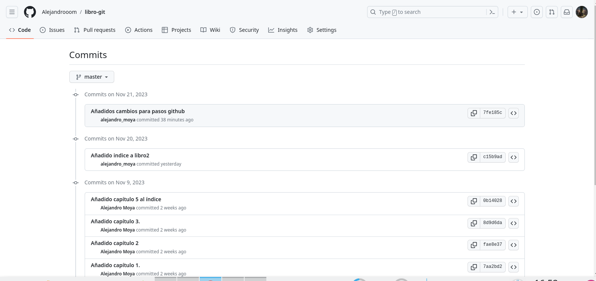

### 5. Repositorios remotos
---

####Ejercicio 1
1. Crear un nuevo repositorio público en GitHub con el nombre **libro-git** .
2. Añadirlo al repositorio local del libro.
3. Mostrar todos los repositorios remotos configurados.
**comandos**
```
git push libro master
git remote add libro url github
```


---

#### Ejercicio 2
1. Añadir los cambios del repositorio local al repositorio remoto de GitHub.
2. Acceder a GitHub y comprobar que se han subido los cambios mostrando el historial de versiones.



#### Ejercicio 3
1. Colaborar en el repositorio remoto **jrochercamps/libro-git**.
2. Clonar su repositorio **libro-git** .
3. Añadir el fichero **autores.txt** que contenga el nombre del usuario y
su correo electrónico.
4. Añadir los cambios a la zona de intercambio temporal.
5. Hacer un commit con el mensaje “Añadido autor.”
6. Subir los cambios al repositorio remoto.
```
git clone <url-repositorio>
git status
git add autores.txt
git commit -m "Añadido autor"
git push <remoto> <rama>
```


---

#### Ejercicio 4
1. Organizaros en parejas
2. Uno de los dos, realizará el “FORK” al otro compañero
3. La persona que ha hecho el FORK, realizará cambios y los subirá a su
repositorio
1. Realizará un pull request al otro compañero
2. Integrar el pull request
3. Invertir los roles
Nota: En este ejercicio, deberéis enviar capturas de los pasos que vayáis
haciendo
```
git clone url del fork
git add .
git commit -m "Descripción de los cambios"
git push <nombre> <rama>

```


---

#### Ejercicio 5
1. Desde vuestra cuenta de GitHub, realizad un «Fork» del repositorio
**jrochercamps/guiaApunts.git**
1. Modificad el fichero README.md, añadiendo vuestro nombre en la tabla.
2. Haced un «Pull request» para contribuir en el repositorio de
«jrochercamps», podéis dejar un comentario.

Nota: En este ejercicio, deberéis enviar capturas de los pasos que vayáis
llevando a cabo. 
```
git clone https://github.com/Alejandrooom/forkdeJose.git
git status
cd forkdeJose
git add .
git commit -m "Añadido mi nombre al archivo README"
git push origin master
```


